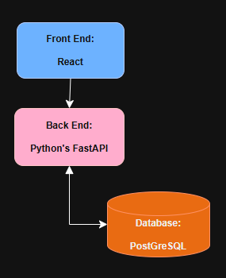

# GAP: Goal Accountibility Partner

Agentic application that helps with all stages of goal creation and completion.

## About

This project is intended to become a full-stack application that has an integrated AI that asks intelligent questions about goals and helps the user accomplish the goals that have been written.

### Main Goals of this Project

1. Build a full-stack application using Python.
    1. ~~Host a local PostgreSQL database.~~
    2. ~~Be able to pull data from database into the client.~~
    3. Be able to perform CRUD operations from a client-facing web interface.
3. Integrate an AI agent into the application, using n8n to design an AI companion.
4. Allow the AI to talk to the user, having intelligent conversations about how a goal is going.
5. Allow the AI to manipulate the application as a user would, updating completed steps (of a goal) or updating obstacles (of a goal).

# General Design



This project is a simple web application that combines a React frontend with a FastAPI backend. There is a PostGreSQL database linked to the backend.

The system design is very simplistic. Most of the complexity in this project comes from the design decisions related to database table management and the AI integration with that data.

## Project Structure

The project structure shown below shows the folder structure of the project, and highlights specific-files when significant

```
gap_web_client
├── backend
│   ├── app
│   │   ├── main.py          # Entry point for the FastAPI application
│   │   ├── api
│   │   ├── core
│   │   ├── db
│   │   │   └── models
│   │   └── schemas
├── frontend
│   ├── public
│   │   └── index.html        # Main HTML file for the React application
│   └── src
└── images
└── README.md                 # Overview of the entire project
└── start_be.bat              # Starts the FastAPI server
└── start_fe.bat              # Starts the React front-end
```

## Running this Project

In order to run this project, you must have a PostgreSQL database running on your local. At a future point, I will update this README with a way to access a database.

Assuming you've got a PostgreSQL database running and assuming it has all the proper tables setup, you can start the application by running these two scripts in two separate terminal sessions:

```
start_be.bat
start_fe.bat
```

## Usage

To access the FastAPI backend, go to: `http://localhost:8000`.

To access the Reat frontend, go to: `http://localhost:3000`. 

